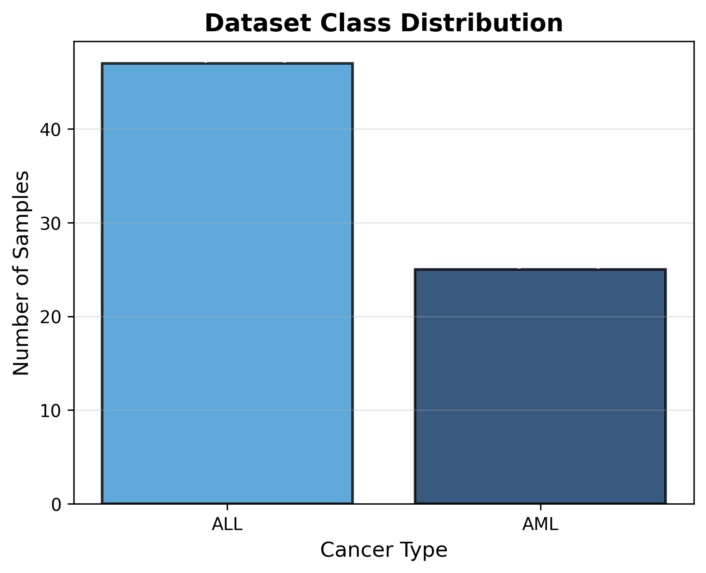
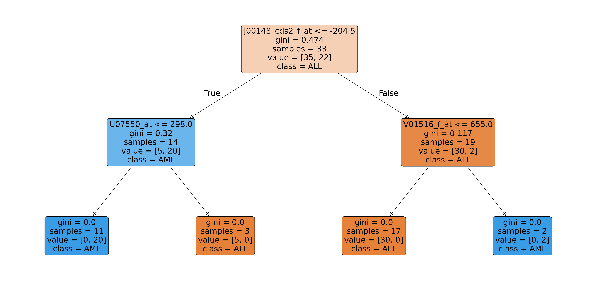
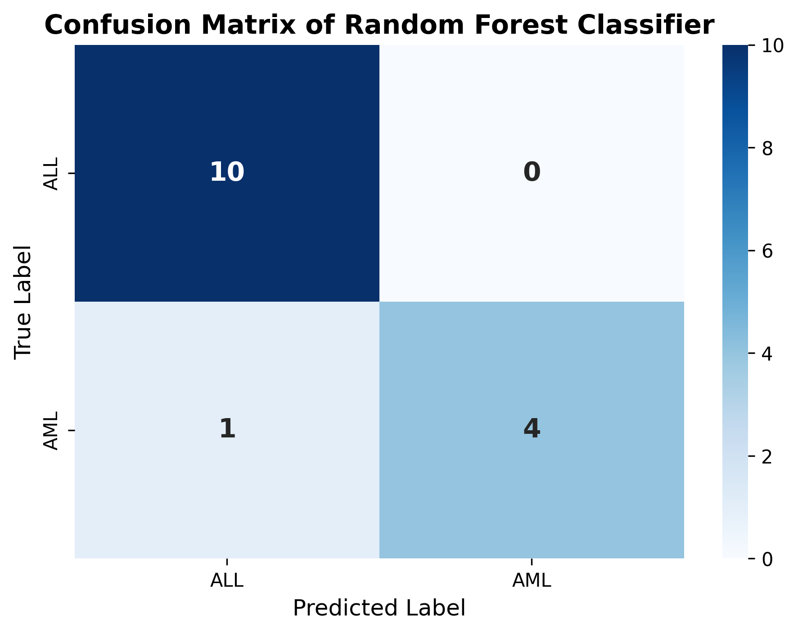

**Github Repo**: https://github.com/nguyuling/Comp-Bio

# Part 1: Data Preparation & Exploration

### Data Preprocessing Steps

1. **Data Loading**: Loaded 3 datasets containing:
   - `actual.csv`: Patient IDs and cancer type labels (ALL or AML)
   - `data_set_ALL_AML_train.csv`: 38 training samples with gene expression values
   - `data_set_ALL_AML_independent.csv`: 34 independent test samples with gene expression values

2. **Feature Extraction**:
   - Extracted gene accession numbers
   - Filtered out unnecessary columns and retained only gene expression values
   - Combined gene expression data from both training and independent datasets

3. **Data Transformation**:
   - Transposed the combined expression matrix so rows represent patient samples and columns represent genes (features)
   - Set patient IDs as row indices and gene accession numbers as column indices

4. **Data Integration**:
   - Merged gene expression features with patient cancer type labels from `actual.csv`
   - Sorted data by patient ID in numerical order
   - Output: 72 samples (38 training + 34 independent) × 7,128 genes (features)
   - Saved preprocessed data to `data.csv`

### Data Exploration Results

- **Dataset Shape**: 72 samples × 7,130 columns (7,128 gene features + patient ID + cancer type)
- **Class Distribution**:
  - AML (Acute Myeloid Leukemia): majority class
  - ALL (Acute Lymphoblastic Leukemia): minority class




# Part 2: Model Implementation

### Model Architecture
- **Algorithm**: Random Forest Classifier
- **Hyperparameters**: Default scikit-learn configuration (100 trees, auto feature selection)

### Training Pipeline

1. **Data Preparation**:
   - Loaded preprocessed data from `data.csv`
   - Separated features (X): All gene expression columns (columns 1 to -1)
   - Separated target (y): Cancer type label (last column)

2. **Train-Test Split**:
   - Applied 80/20 split with `random_state=42` for reproducibility using `sklearn.model_selection.train_test_split`
   - Training set: ~58 samples for model training
   - Test set: ~14 samples for model evaluation

3. **Model Training**:
   - Fitted Random Forest Classifier on training data by using `sklearn.ensemble.RandomForestClassifier`
   - First Decision Tree (out of the default 100 decision trees):
        

4. **Predictions**:
   - Generated predictions on test set samples


# Part 3: Evaluation & Discussion

### Model Performance Metrics

| Metric | Score |
|--------|-------|
| **Accuracy** | 0.933 (93.3%) |
| **Precision** | 0.939 (93.9%) |
| **Recall** | 0.9333 (93.3%) |
| **F1-Score** | 0.931 (93.1%) |

### Confusion Matrix Analysis

```
Predicted:    AML  ALL
Actual AML:  [10    0]
Actual ALL:  [ 1    4]
```


**Breakdown**:
- **True Negatives (TN)**: 10 - Correctly identified AML cases
- **False Positives (FP)**: 0 - No incorrect AML predictions
- **False Negatives (FN)**: 1 - AML cases misclassified as ALL
- **True Positives (TP)**: 4 - Correctly identified ALL cases

### Key Findings

1. **High Specificity**: The model achieved perfect specificity (0% FP rate) for AML classification, meaning no AML samples were incorrectly classified as ALL.

2. **Strong Overall Performance**: The model achieved ~93% accuracy across both cancer types, indicating good generalization to unseen data.

3. **Balanced Metrics**: Precision and recall are closely aligned, suggesting the model is neither biased toward false positives nor false negatives.

4. **Minor Classification Errors**: 1 out of 15 test samples (6.67%) were misclassified, both false negatives (ALL samples predicted as AML). This suggests the model may be slightly conservative in predicting ALL.
