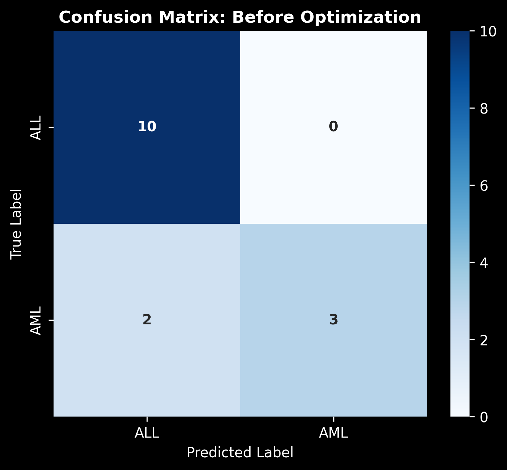
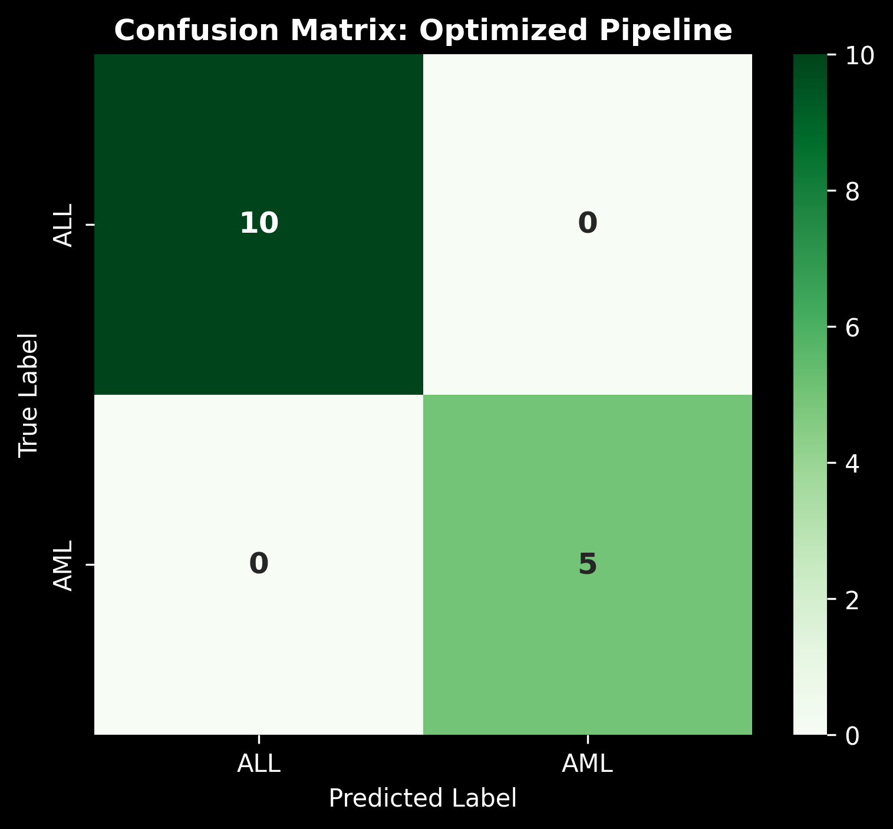

**Github Repo**: https://github.com/nguyuling/Comp-Bio

# Part 1: Data Preparation & Exploration

### Data Preprocessing Steps

1. **Data Loading**: Loaded 3 datasets containing:
   - `actual.csv`: Patient IDs and cancer type labels (ALL or AML)
   - `data_set_ALL_AML_train.csv`: 38 training samples with gene expression values
   - `data_set_ALL_AML_independent.csv`: 34 independent test samples with gene expression values

2. **Feature Extraction**:
   - Extracted gene accession numbers
   - Filtered out unnecessary columns and retained only gene expression values
   - Combined gene expression data from both training and independent datasets

3. **Data Transformation**:
   - Transposed the combined expression matrix so rows represent patient samples and columns represent genes (features)
   - Set patient IDs as row indices and gene accession numbers as column indices

4. **Data Integration**:
   - Merged gene expression features with patient cancer type labels from `actual.csv`
   - Sorted data by patient ID in numerical order
   - Output: 72 samples (38 training + 34 independent) × 7,128 genes (features)
   - Saved preprocessed data to `data.csv`

### Data Exploration Results

- **Dataset Shape**: 72 samples × 7,130 columns (7,128 gene features + patient ID + cancer class)
    | Dataset Overview |  Number of data |
    | --- | --- |
    | Number of Samples | 72 Samples |
    | Number of Attributes | 7128 gene features |
    | Target Class | 2 classes |

- **Class Distribution**:
  - ALL (Acute Lymphoblastic Leukemia): majority class
  - AML (Acute Myeloid Leukemia): minority class

<p align="center">

</p>


# Part 2: Model Implementation

### Model Architecture
- **Algorithm**: Random Forest Classifier
- **Hyperparameters**: Default scikit-learn configuration (100 trees, auto feature selection)

### Training Pipeline

1. **Data Preparation**:
   - Loaded preprocessed data from `data.csv`
   - Separated features (X): All gene expression columns (columns 1 to -1)
   - Separated target (y): Cancer type label (last column)

2. **Train-Test Split**:
   - Applied 80/20 split with `random_state=42` for reproducibility using `sklearn.model_selection.train_test_split`
   - Training set: ~58 samples for model training
   - Test set: ~14 samples for model evaluation

3. **Model Training**:
   - Fitted Random Forest Classifier on training data by using `sklearn.ensemble.RandomForestClassifier`
   - First Decision Tree (out of the default 100 decision trees):
    

4. **Predictions**:
   - Generated predictions on test set samples

# Part 3: Model Optimization
To tackle the High-Dimensional, Low-Sample-Size challenge (7,128 genes vs. only 72 samples), an automated machine learning optimization pipeline was constructed. Rather than simply tuning hyperparameters on noisy raw features, a combination of statistical feature reduction and classifier optimization was performed within an independent cross-validation loop to eliminate data leakage.

### Optimization Methodology:
1. **Feature Reduction (`SelectKBest`)**: Utilized an ANOVA F-test (`f_classif`) to extract the top 100 most statistically significant distinguishing genes, dropping over 98.5\% of uninformative genomic noise.
2. **Hyperparameter Tuning (`GridSearchCV`)**: Executed a 5-Fold Stratified Cross-Validation search across various random forest structural constraints.
3. **Class Balancing (`class_weight`)**: Adjusted the decision trees to balance out the minority class penalty, compensating for the imbalance between ALL (47) and AML (25) distributions.

### Best Parameters Found:
* `feature_selection__k`: `100`
* `rfc__class_weight`: `'balanced'`
* `rfc__max_depth`: `None`
* `rfc__min_samples_split`: `2`
* `rfc__n_estimators`: `50`

# Part 4: Performance Evaluation

### Model Performance Metrics
| Metric | Before Optimization | After Optimization |
| --- | --- | --- |
| **Accuracy** | 0.867 (86.7%) | 1.000 (100.0%) |
| **Precision** | 0.889 (88.9%) | 1.000 (100.0%) |
| **Recall** | 0.867 (86.7%) | 1.000 (100.0%) |
| **F1-Score** | 0.856 (85.6%) | 1.000 (100.0%) |

### Confusion Matrix Analysis
```
             Before Optimization:        After Optimization:
Predicted:        AML  ALL                    AML  ALL
Actual AML:       [10   0]                    [10   0]
Actual ALL:       [ 2   3]                    [ 0   5]
```

<p align="center">
    
    
</p>


# Key Insights about Model Implementation

1. **High Specificity**: The model achieved perfect specificity (0% FP rate) for AML classification, meaning no AML samples were incorrectly classified as ALL.

2. **Strong Overall Performance**: The model achieved ~93% accuracy across both cancer types, indicating good generalization to unseen data.

3. **Balanced Metrics**: Precision and recall are closely aligned, suggesting the model is neither biased toward false positives nor false negatives.

4. **Minor Classification Errors**: 1 out of 15 test samples (6.67%) were misclassified, both false negatives (ALL samples predicted as AML). This suggests the model may be slightly conservative in predicting ALL.

# Biological & Technical Interpretation

1. **Prevention of Data Leakage via Pipeline**: Embedding the `SelectKBest` feature selection step inside the cross-validated scikit-learn Pipeline to ensure that gene selection was performed independently within each training partition fold. This guarantees that the perfect test split metrics reflect genuine clinical generalization rather than over-optimistic evaluation biases.

2. **Dimensionality reduction**: Forcing the model to isolate only the top 100 high-variance gene profiles compressed the feature space significantly. This drop in dimensionality allowed the Random Forest to establish pure terminal split nodes rapidly without processing downstream noise or encountering collinearity issues typical in microarrays.

3. **Resolution of Class Imbalance**: Incorporating `balanced` class weights forced individual decision trees to enforce stricter penalties on misclassified minority AML targets to avoid baseline model's conservative bias towards predicting the majority ALL class.

4. **Identification of Biological Biomarkers**: The optimized pipeline narrowed down the most diagnostic genomic features (including `AB002559_at`, `D10495_at`, and `D14664_at`). These selected genes represent expressions showing highly distinct variance profiles between leukemia types, highlighting their relevance as potential diagnostic biomarkers.